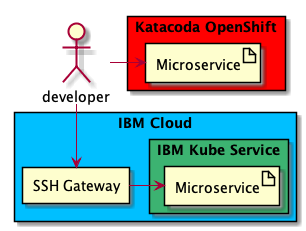

# Infrastructure setup & DevOps Toolchain

This is a starting lab to set up all the tools and environment access for effective completion of the next labs

- [Infrastructure setup & DevOps Toolchain](#infrastructure-setup--devops-toolchain)
  - [1. Environment overview](#1-environment-overview)
  - [2. Dev tools installation and setup](#2-dev-tools-installation-and-setup)
    - [2.1 Visual Studio Code](#21-visual-studio-code)
    - [2.2 Node.js](#23-nodejs)
  - [3. Environment connectivity](#3-environment-connectivity)
    - [3.1 Connection to IBM Cloud](#32-connection-to-ibm-cloud)
    - [3.2 Connection to IBM Kubernetes cluster](#34-connection-to-ibm-kubernetes-cluster)
  - [4. GitHub account](#4-github-account)
    - [4.1 Install git tool](#41-install-git-tool)
    - [4.2 Register in GitHub public](#42-register-in-github-public)
    - [4.3 Create a repository for lab 2 application](#43-create-a-repository-for-lab-2-application)

## 1. Environment overview



During the course of the bootcamp we will need to develop a Node.js application, publish its code to GitHub and deploy to Red Hat Open Shift.
We will also containerise the developed application and deploy it to IBM Kubernetes Service cluster. For the purpose of simplification of lab setup:

- Node.js runtime
- IBM Cloud command line tools
- IBM Cloud plugins
- Kubernetes command line tools
- Java SDK (if needed)

## 2. Dev tools installation and setup

Node.js development tools should be installed in local workstation

### 2.1 Visual Studio Code

Microsoft VS Code will be used to code Node.js applications.
Download Visual Studio Code for Javascript development [https://code.visualstudio.com/download](https://code.visualstudio.com/download)
and make sure that it starts after installation. You don't have to use Visual Studio Code if you already have another editor/IDE that you prefer.

### 2.2 Node.js

To develop and run Node.js applications, download and install Node.js Latest LTS version [https://nodejs.org/en/download/](https://nodejs.org/en/download)
Check that npm and node commands are available in from a command line:

```sh
npm -v
node -v
```

The output should be similar to, or greater version than:

```sh
$ npm -v
6.4.1

$ node -v
v10.15.1
```
### 3.2 Connection to IBM Cloud

You should be able to connect to IBM Cloud using your IBM Intranet ID:

```sh
ibmcloud login --sso -a api.eu-gb.bluemix.net
```

Please use your own account using above command.

To target resource group required for labs, run the following command:

```sh
ibmcloud target -g Default
```

You should now be able to see list of services in the cloud account by running:

```sh
ibmcloud resource search *
```

Check the list of currently installed command line plugins:

```sh
ibmcloud plugin list
```

(don't worry if there are no plugins installed yet).

Install the container service plugin into the IBM Cloud command line tool

```sh
$ ibmcloud plugin install container-service

Looking up 'container-service' from repository 'IBM Cloud'...
Plug-in 'container-service/kubernetes-service 0.4.3' found in repository 'IBM Cloud'
Attempting to download the binary file...
 20.49 MiB / 20.49 MiB [==============================] 100.00% 1s
21480992 bytes downloaded
Installing binary...
OK
Plug-in 'container-service 0.4.3' was successfully installed into ~/.bluemix/plugins/container-service. Use 'ibmcloud plugin show container-service' to show its details.
```

Install the container registry plugin into the IBM Cloud command line tool

```sh
$ ibmcloud plugin install container-registry
```

### 3.4 Connection to IBM Kubernetes cluster

Update configuration with labs cluster name

```sh
ibmcloud ks cluster config --cluster cnb-iks
```

Check the command output and export environment variables as in the output:

```sh
export KUBECONFIG=~/.bluemix/plugins/container-service/clusters/cnb-iks/kube-config-lon02-cnb-iks.yml

echo "export KUBECONFIG=~/.bluemix/plugins/container-service/clusters/cnb-iks/kube-config-lon02-cnb-iks.yml" >> .bash_profile
```

You should now be able to see the list of running pods:

```sh
kubectl get pods
```

## 4. GitHub account

GitHub public GIT repository will be used to store application code, that will be shared between developer and fetched by Continuous Delivery. Complete these steps from your laptop and using your own email address.

### 4.1 Install git tool

- Linux:
    ```sh
    apt-get install git
    ```
- Windows:
  Download and install using the following link [http://git-scm.com/download/win](http://git-scm.com/download/win)

- Mac:
  It may be installed already, try by running the following command:
    ```sh
    git --version
    ```

If it is not installed, please download using the following link [https://git-scm.com/download/mac](https://git-scm.com/download/mac)

### 4.2 Register in GitHub public

Register at [https://github.com](https://github.com)
  
### 4.3 Create a repository for lab 2 application

- Log in to [https://github.com](https://github.com)
- Click `Create new repository` button and select the following values:
  - Name: `shipping-service`
  - Initialize this repository with a README: checked
  - Add gitignore for `Node`

Open terminal, and clone the repository to your machine: copy the repository link (SSH type) from the GitHub, and do the `git clone <repo_url>`. To use SSH type git url, you need to have uploaded your SSH keys to the github. If you don't have it, and don't ant to [use github documentation to add them](https://help.github.com/articles/adding-a-new-ssh-key-to-your-github-account/), you can use HTTPS url, it just will ask for password on each remote operation. The `clone` command will create folder `shipping-service`, this will be your working directory.

If you never used Git before, please set your name and email:

```sh
cd shipping-service
git config user.name "Demo User XX"
git config user.email "demouserXX@lab-cnb.ibm.com"
```

That's it, you have finished preparation of your environment.
